<!--
  ╔══════════════════════════════════════════════════════════════╗
  ║  shr-98 · profile README                                     ║
  ║  Search for "TODO" before committing — see SETUP.md.         ║
  ╚══════════════════════════════════════════════════════════════╝
-->

 

  

<!-- ─────────── CONTACT RAIL · TODO: replace the 4 placeholder URLs ─────────── -->

 

 

<!-- ═══════════════════════════════════════════════════════════════
     THE 10-SECOND READ — everything a hiring manager needs up top
     ═══════════════════════════════════════════════════════════════ -->

## ⚡ &nbsp;The 10-second version

> I build **production web apps end to end** — React front ends, ASP.NET Core / Spring Boot APIs,
> SQL and NoSQL data layers, shipped on AWS. Two-plus years across ERP and SaaS products, currently
> building React at **Lockated**. MCA in Data Science, so I reach for ML when it actually moves a number.

<table>
<tr>
<td valign="top" width="50%">

**🎯 Currently** 
`React Developer (Full Stack)` @ **Lockated**, Pune 
Dec 2025 → present

**📈 Experience** 
2+ years · ERP &amp; SaaS · product teams

**🗺️ Base** 
Noida, UP, India · open to remote / relocation

</td>
<td valign="top" width="50%">

**⚡ Core strengths** 
React 18 + TypeScript · REST API design 
Relational data modelling · AWS deploys

**🎓 Education** 
MCA, Data Science — Amity University 
BCA — Panjab University

**🌍 Languages** 
Hindi (native) · English (C1) · German (A1 → B1)

</td>
</tr>
</table>

---

<!-- ═══════════════════════════════════════════════════════════════
     TECH ARSENAL
     ═══════════════════════════════════════════════════════════════ -->

## 🧰 &nbsp;Tech arsenal

<table>
<tr>
<td align="center" width="20%"><b>Frontend</b></td>
<td></td>
</tr>
<tr>
<td align="center"><b>Backend</b></td>
<td></td>
</tr>
<tr>
<td align="center"><b>Data</b></td>
<td> </td>
</tr>
<tr>
<td align="center"><b>Cloud &amp; DevOps</b></td>
<td></td>
<!-- TODO: add anything else you genuinely use — docker, githubactions, linux, redux, tailwind, nextjs, nodejs, jenkins, jira, figma … full icon list at https://skillicons.dev -->
</tr>
<tr>
<td align="center"><b>ML / Data Science</b></td>
<td></td>
</tr>
</table>

<b>🔍 &nbsp;How deep does each one go?</b> (click to expand)

 

| Level | What it means | Tools |
|:--|:--|:--|
| **Daily driver** | I ship production code in this every week | React 18, TypeScript, JavaScript, C# / ASP.NET, MySQL, MSSQL, Git |
| **Comfortable** | Have built and shipped real features with it | Vite, Java / Spring Boot, Python, MongoDB, AWS EC2 & S3, REST API design |
| **Working knowledge** | Used it on projects, would ramp fast | Scikit-Learn, TensorFlow, PyTorch, OpenCV, HTML5 / CSS3 |
| **Currently levelling up** | <!-- TODO: replace with what you're actually learning --> System design, testing, German 🇩🇪 |

---

<!-- ═══════════════════════════════════════════════════════════════
     FEATURED WORK
     ═══════════════════════════════════════════════════════════════ -->

## 🚀 &nbsp;Featured work

 

<b>🗂️ &nbsp;Jiraly — project &amp; issue tracker with one-click meetings</b> &nbsp;<code>Python</code> <code>JavaScript</code>

 

A Jira-style tracker that closes the gap between "we should talk about this ticket" and actually
being in a call: it generates **Jitsi / Google Meet / Zoom / Teams** links straight from an issue and
emails the invites out.

- **Problem** — issue trackers make you leave the tool to schedule a conversation about the issue.
- **Approach** — ticket boards + a meeting-link service layer per provider, with templated email invites.
- **Stack** — Python backend, JavaScript front end, SMTP invites.
- **What I'd do next** <!-- TODO: make this specific and true --> — calendar sync, recurring standups, role-based access.

**→ [Browse the code](https://github.com/shr-98/meetlink-mvp)**

<b>🎟️ &nbsp;BookMyShow Clone — seat-selection booking flow</b> &nbsp;<code>React</code> <code>JavaScript</code>

 

A ticket-booking interface modelled on BookMyShow, built to get the fiddly parts right:
seat maps, unavailable-seat state, show/time selection and a booking summary that stays in sync.

- **Why it's interesting** — the seat grid is genuine state-management practice, not a to-do list.
- **Stack** — React, JavaScript, component-driven UI.
- **Demo** — GIF walkthrough in the repo README.

**→ [Browse the code](https://github.com/shr-98/bookmyshow-clone)**

<b>🏢 &nbsp;PropFlow UI — property-management front end</b> &nbsp;<code>React</code> <code>TypeScript</code>

 

A typed React front end for property management — the kind of dense, table-and-form-heavy
interface that real ERP users live in all day.

- **Focus** — TypeScript-first components, predictable data flow, reusable table/form primitives.
- **Stack** — React 18, TypeScript, Vite.

**→ [Browse the code](https://github.com/shr-98/propflow-ui)**

<b>🧠 &nbsp;SmartFaceID — face detection &amp; recognition</b> &nbsp;<code>Python</code> <code>OpenCV</code>

 

Face detection and recognition across images and live video, wrapped in a desktop UI so it's
usable by someone who doesn't want to touch a terminal.

- **Focus** — the classic CV pipeline (detect → encode → match) plus a UI that makes it demoable.
- **Stack** — Python, OpenCV, Tkinter.

**→ [Browse the code](https://github.com/shr-98/SmartFaceID)**

---

<!-- ═══════════════════════════════════════════════════════════════
     GITHUB ANALYTICS
     ═══════════════════════════════════════════════════════════════ -->

## 📊 &nbsp;GitHub, by the numbers

  

  

  

---

<!-- ═══════════════════════════════════════════════════════════════
     EXPERIENCE
     ═══════════════════════════════════════════════════════════════ -->

## 💼 &nbsp;Where I've worked

<table>
<tr>
  <td width="5"  align="center">🟢</td>
  <td width="24%"><b>Lockated</b> Pune, India</td>
  <td width="26%"><b>React Developer (Full Stack)</b></td>
  <td width="20%"><code>Dec 2025 — present</code></td>
  <td>React 18 · TypeScript · REST APIs · SQL</td>
</tr>
<tr>
  <td align="center">⚪</td>
  <td><b>JIVU Infosolutions</b> Lucknow, India</td>
  <td><b>Software Engineer</b></td>
  <td><code>Oct 2023 — Dec 2024</code></td>
  <td>ASP.NET / C# · React · MSSQL · ERP modules</td>
</tr>
</table>

<b>📌 &nbsp;What I actually shipped</b> (click to expand)

 

> <!-- ══ TODO ══════════════════════════════════════════════════════════
>      This section is what separates a good profile from a great one.
>      Replace each line with something specific and measurable.
>      Format that works: [what I built] → [how] → [the number it moved].
>      e.g. "Rebuilt the ERP invoice module in React 18 + TS, cutting
>            page load from 4.2s to 1.1s for ~300 daily users."
>      ═══════════════════════════════════════════════════════════════ -->

**Lockated** — React Developer (Full Stack)
- Built and shipped `<feature>` used by `<N>` users, `<measurable outcome>`.
- Cut `<metric>` from `<before>` to `<after>` by `<what you did>`.
- Owned `<module / surface>` end to end — UI, API, schema.

**JIVU Infosolutions** — Software Engineer
- Delivered `<ERP module>` in ASP.NET + React for `<client / scale>`.
- Reduced `<manual process>` to `<automated outcome>`, saving `<time>`.
- Optimised `<query / endpoint>`, improving response time by `<%>`.

---

<!-- ═══════════════════════════════════════════════════════════════
     EDUCATION + NOW
     ═══════════════════════════════════════════════════════════════ -->

<table>
<tr>
<td valign="top" width="50%">

## 🎓 &nbsp;Education

**MCA — Data Science** 
Amity University · `2021 – 2023` 
ML, statistics, data engineering — the foundation behind SmartFaceID.

**BCA** 
Panjab University · `2017 – 2021`

</td>
<td valign="top" width="50%">

## 🌱 &nbsp;Right now

- 🔭 Building React front ends for property/ERP products at **Lockated**
- 📚 Going deeper on **system design** and **TypeScript at scale** <!-- TODO: make this true -->
- 🇩🇪 Pushing German from **A1 → B1**
- 🤝 Open to **full stack / React** roles — remote or relocation
- 💬 Ask me about React state, .NET APIs, or SQL that won't fall over

</td>
</tr>
</table>

---

<!-- ═══════════════════════════════════════════════════════════════
     CONTRIBUTION SNAKE — generated by .github/workflows/snake.yml
     ═══════════════════════════════════════════════════════════════ -->

### 🐍 &nbsp;Watch a snake eat my commits

<picture>
  <source media="(prefers-color-scheme: dark)" srcset="https://raw.githubusercontent.com/shr-98/shr-98/output/github-snake-dark.svg" />
  <source media="(prefers-color-scheme: light)" srcset="https://raw.githubusercontent.com/shr-98/shr-98/output/github-snake.svg" />
  
</picture>

---

<!-- ═══════════════════════════════════════════════════════════════
     FOOTER
     ═══════════════════════════════════════════════════════════════ -->

### 📬 &nbsp;Let's build something

I'm open to **full stack / React** opportunities and interesting side projects.
Fastest way to reach me is LinkedIn or email — I reply to everything.

 

&nbsp;

&nbsp;

&nbsp;

  

<i>⭐ If something here is useful, a star costs nothing and makes my day.</i>

